<h1>Consumo de agua en hogares &#128167; </h1>
<h2>Cómo compilar/ejecutar</h2>

Para poder utilizar el código necesitamos descargar ya sea la carpeta o un archivo en específico. 
Para poder descargar la carpeta se hacen los siguientes pasos:

<ol>
  <li>En el proyecto de GitHub nos vamos al apartado de <strong>Code</strong> que se encuentra en la parte superior derecha del proyecto.</li>
  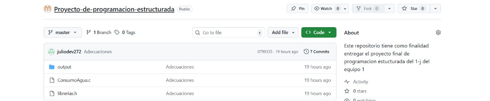
  <li>En el apartado de <strong>Local</strong>, seleccionamos la opción <strong>Download ZIP</strong> para descargar la carpeta completa.</li>
    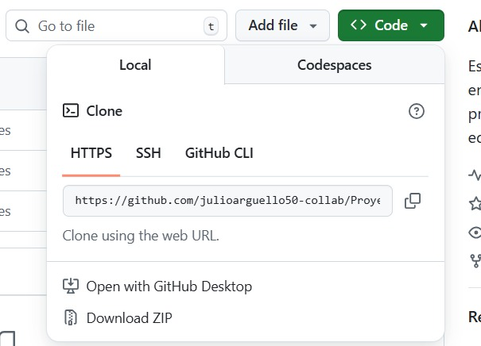
  <li>Vamos a los archivos y descomprimimos la carpeta del proyecto.</li>
    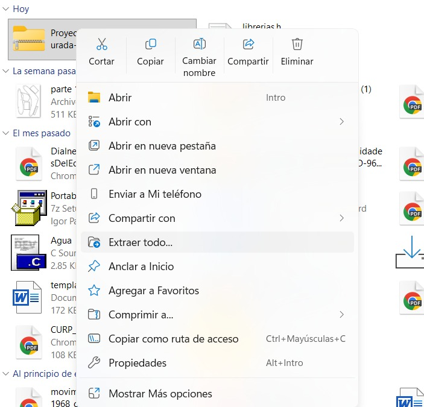
  <li>Damos clic en <strong>Extraer</strong>.</li>
    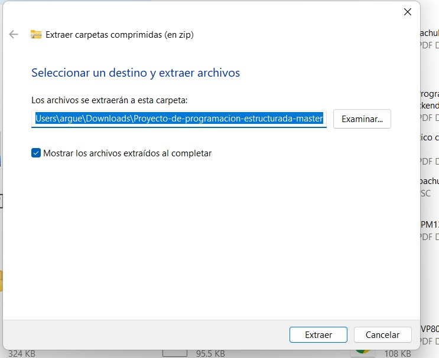
  <li>Ya tenemos la carpeta completamente descargada para poder ser utilizada.</li>
    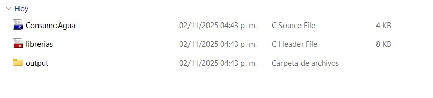
</ol>

Una vez descargada la carpeta necesitamos un <strong>IDE (Entorno de Desarrollo Integrado)</strong> para poder ejecutar el código que en este caso está hecho en el lenguaje C. 

Los IDE más populares para ejecutar código C son los siguientes:

<ul>
  <li>Visual Studio Code (VS Code) </li>
  <li>Visual Studio</li>
  <li>Dev-C++</li>
</ul>

También existen compiladores en línea que pueden ejecutar código C, algunos ejemplos son:

<ul>
  <li>GDB Online Debugger</li>
  <li>myCompiler</li>
  <li>OneCompiler</li>
</ul>

Para esta ocasión se usará <strong>Visual Studio Code</strong> ya que es el más popular para ejecutar código C.

<h3>
Como ejecutar codigo C en vscode
</h3>

Para poder ejecutar nuestro proyecto es importante que la computadora que se utilice para compilar tenga el compilador de C ya que sin este el codigo no podra ser ejecutado por <strong>Vs code</strong> para esto tenemos que entrar a la terminal de la computadora. 

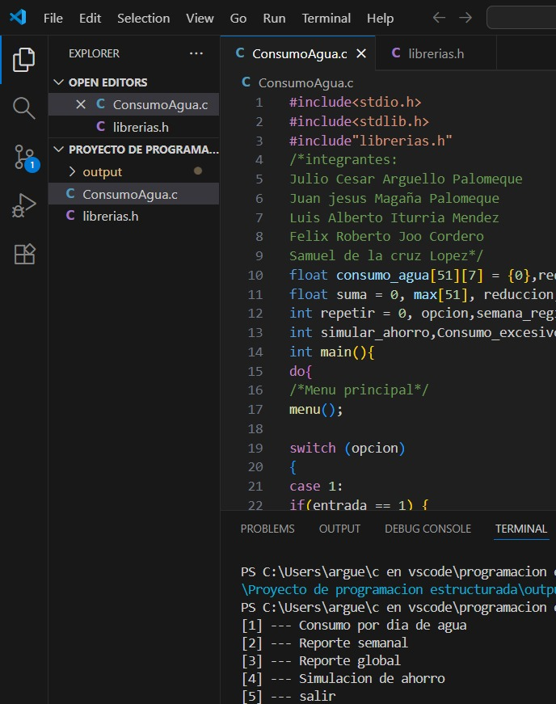

Para windows se utiliza la tecla windows + r 
Para mac con el atajo de teclado ⌘ + Espacio, escribir "Terminal" y presionar Enter. 
se ejecuta el comando gcc -version. 
Si no aparece la version es porque no tienes el compilador si es asi en el siguiente enlace es para un video en youtube para poder instalar el compilador
<a href="https://www.youtube.com/watch?v=GEZLjRSY_m8&t=306s">Instalar el compilador de para C/C++</a>

Una vez hecho esto basta con abrir la carpeta previamente descargada denominada <strong>Proyecto de programacion estructurada</strong> y abrir el archivo <strong>ConsumoAgua.C</strong>
Despues en el editor de codigo para compilar nos hiremos a la parte superior derecha y daremos clic en el triangulo para poder compilar y ejecutar el codigo. 

Finalmente se podra visualizar el programa ya compilado para poder ser usado.

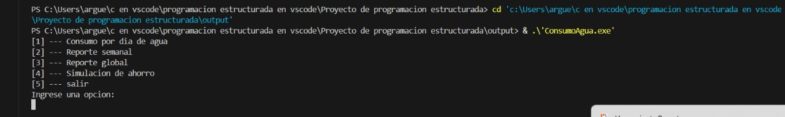

<h2>
DISTRIBUCION DE TAREAS
</h2>

A continuacion se presentan las variables que se utilizaron en la creacion del programa. 
En este proyectos se utilizaron variables de dos tipos. Enteros y flotantes, cada uno de estos tiene un proposito distinto mismo que se presenta a continuacion.
Es importante mencionar que para declarar todas las varibales es importante ponerlas antes de la funcion principal<strong> int main() </strong>para que el programa las tome como variables globales.
Las variables globales son utiles cuando queremos usar variables en dos archivos en nuestro fue necesario debido que se creo la carpeta de librerias. h la cual contenia funciones que utilizan las mismas variables que se utilizan en el programa principal. 

Para poder utilizarlas en librerias.h basta con poner la palabra extern al inicio de cada tipo de variable <strong>"exter int valor;"</strong> lo cual indica que las variables provienen de un codigo fuente.
Una vez entendido esto procedemos a explicar cada una de las variables utilizadas.

<h3>
Variables de tipo entero
</h3>

Las variables de tipo entero son aquellas que guardan numeros enteros exclusivamente, no se pueden guardar numeros decimales ni caracteres, solo numeros enteros. Las variables de tipo entero fueron utilizadas para contadores, registros, opciones que ingresa el usuario y para acumuladores.
  <table border =1>
    <tr>
      <td>
opcion
</td>
      <td>Es la primera variable en utilizarse ya que se utiliza para guarda la opcion que el usuario eliga dentro del menu principal del programa</td>
    </tr>
    <tr>
      <td>
Repetir
</td>
      <td>Esta variable tiene como objetivo representar los 7 dias de la semanas. Esta variable se utiliza en los bucles donde se busca ya sea pedir los datos para 7 dias o para imprimir los datos de 7 dias</td>
    </tr>
    <tr>
      <td>
semana_registro
</td>
      <td>Se utiliza para registrar la cantidad de semanas que el usuario va a registrar</td>
    </tr>
    <tr>
      <td>
entrada
</td>
      <td>Es empleado en el caso 1 del programa ya que si se ingresa por primera vez (entrada valdra 1) el programa preguntara cuantas semanas va a registrar, en caso de que el usuario vuelva a ingresar a la opcion 1 ahora le preguntara si quiere agregar una semana mas por lo que el valor de entrada sera 2 (entrada == 2)</td>
    </tr>
    <tr>
      <td>
Semana_extra
</td>
      <td>Esta variable se utiliza cuando el usuario quiera agregar una semana mas se guarda en esa variable y repite el proceso de llenado de datos</td>
    </tr>
    <tr>
      <td>
contador
</td>
      <td>Se utiliza para representar las semanas que el usuario registre dentro de los bucles</td>
    </tr>
    <tr>
      <td>
J
</td>
      <td>Este contador tiene varias funcionalidades. Una de ellas sirve como contador para imprimir las semanas registradas con sus respectivos datos. Otra funcionalida esta en la impresion de las semanas, <strong>J</strong> se utiliza para representar las semanas a imprimir.</td>
    </tr>
    <tr>
      <td>
i
</td>
      <td>Se utiliza para representar a los dias en la impresion de los dias para el caso 2 y caso 4, ademas que en el caso 4 el contador i se utiliza para calcular la reduccion de agua</td>
    </tr>
    <tr>
      <td>
semanas_imprimir
</td>
      <td>Esta variable se utilizar guardar e imprimir las semanas que el usuario pida con sus respectivos datos de cada semana</td>
    </tr>
    <tr>
      <td>
simular_ahorro
</td>
      <td>Se utiliza para guardar el porcentaje de reduccion que se desea aplicar a una semana</td>
    </tr>
    <tr>
      <td>
Consumo_excesivo
</td>
      <td>Se utiliza para guardar la cantidad de dias que superaron el umbral de agua en una semana. El umbral establecido para el programa es de 300 litros al dia</td>
    </tr>
    <tr>
      <td>
Consumo_global
</td>
      <td>Se utiliza para guardar la cantidad de dias que superaron el umbral de agua en todas las semanas registradas</td>
    </tr>
  </table>
<h3>
Variables de tipo flotante
</h3>

Las variables de tipo flotante pueden almacenar numeros enteros y decimales con el inconveniente que a la hora de imprimir los valores de tipo flotante es importante especificar cuantos decimales se ocupar mostrar en pantalla como por ejemplo <strong>"%.2f".</strong>. 
En este programa las variables de tipo flotante se utilizan para guardar los resultados de las operaciones que se realizen ademas para guardar datos que puedan ser introducidos en deciamales. Los arreglos utilizados son de tipo flotante que mas adelante se explica el porque de esta decision

  <table border=1>
    <tr>
      <td>
consumo_agua[51]]7]
</td>
      <td>Este arreglo se utiliza para registrar los litros que el usuario ingrese por dia y todas las semanas que el usuario registre. Este arreglo tiene como maximo 51 filas para semanas esto debido que son la cantidad de semanas que contiene un y 7 columnas que representas los 7 dias de la semana</td>
    </tr>
    <tr>
      <td>
promedio_agua[51]
</td>
      <td>Este arreglo suma el consumo de agua de los 7 dias semanas registrados. Este arreglo contiene 51 espacios los cuales representan las semanas que contiene un año, esto quiere decir que guarda el consumo de agua de 51 semanas</td>
    </tr>
    <tr>
      <td>
max[51]
</td>
      <td>Este arreglo es utilizado en el registro de agua de una semanas donde va comparando cada uno de los valores y guarda el valor mayor de los 7 dias. Este arreglo tiene 51 espacios lo que significa que puede guardar el mayor consumo de agua de 51 semanas</td>
    </tr>
    <tr>
      <td>
suma_global
</td>
      <td>Guarda la cantidad de agua consumida en todas las semanas registradas</td>
    </tr>
    <tr>
      <td>
reduccion_agua
</td>
      <td>Guarda e imprime la cantidad de agua a consumir si se hace una reduccion a su consumo original</td>
    </tr>
    <tr>
      <td>
promedio_global
</td>
      <td>Calcula el promedio agua consumida en todas las semanas registradas para mostrar un promedio global</td>
    </tr>
    <tr>
      <td>
promedio_semana
</td>
      <td>Calcula el promedio de agua consumida en una semana</td>
    </tr>
    <tr>
      <td>porcentaje_reduccion</td>
      <td>convierte el numero que ingreso el usuario para la reduccion de agua en decimal para poder manejarlo en el calculo de reduccion de agua</td>
    </tr>
    <tr>
      <td>
ahorro_agua
</td>
      <td>suma la cantidad de agua ahorrada de los 7 dias para obtener el total de agua ahorrada en la semana reducida</td>
    </tr>
  </table>
  <h3>Casos de Prueba</h3>
<ul>
  <li>Caso 1: Al iniciar el código nos muestra el menú principal, cuando queremos
ingresar una letra, o un número negativo nos marcara error el programa diciendo
que solo permite números mayor a 0 y al ingresar un número mayor a 5 nos marcara
opción no valida, después nos vuelve a reiniciar a la misma opción que ingresemos.</li>
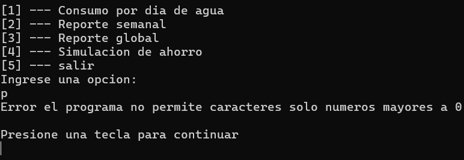
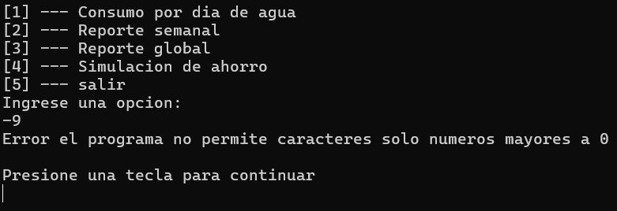
  <li>Caso 2: Al ingresar el consumo de agua por día, cuando queremos ingresar una
letra o un numero negativo nos marcara error el programa diciendo que solo permite
número mayor a 0.</li>
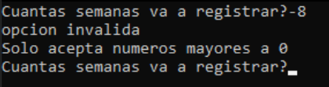
  <li>Caso 3: Al ingresar el consumo por día de agua , cuando queremos ingresar más
de 51 semana ya sea 61 nos marcara error el programa no permite caracteres solo
número mayor a 0 y que también tiene un límite de semanas que son 51 semanas.</li>
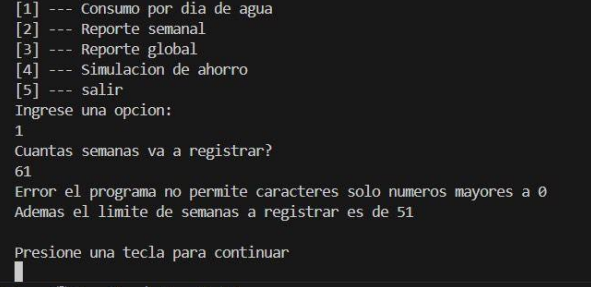
<li>Caso 4: Al ingresar el consumo por día de agua, cuando queremos ingresar el
consumo del día 1 en litros si pone una cantidad más grande nos va a marcar una
alerta diciendo consumo excesivo de agua o posible fuga de agua, pero no nos
marcara error, pero nos ira contando los consumos de litros por días, así como
aparece en la imagen.</li>
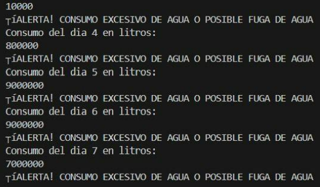
</ul>
<link href="style.css"
